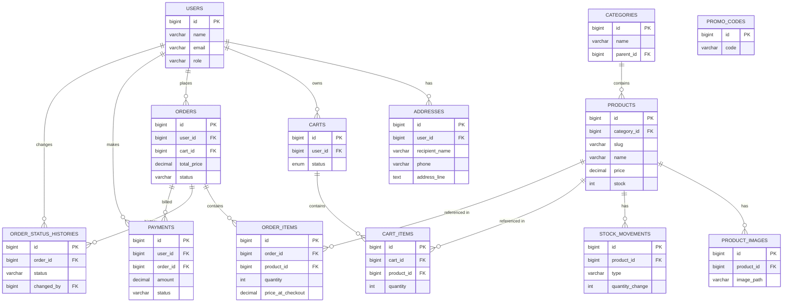

# ERD dan Ringkasan Skema — Charmbuddy

Dokumen ini merangkum tabel utama, kolom penting, relasi (PK/FK), dan diagram ER (Mermaid) berdasarkan migration dan model di `charmbuddy-backend`.

## Ringkasan Tabel (kolom penting)

- **users**: `id` PK, `name`, `email` (unique), `role`, `avatar_path`, `password`, `email_verified_at`, timestamps
- **addresses**: `id` PK, `user_id` FK -> `users.id`, `recipient_name`, `phone`, `address_line`, `city`, `province`, `postal_code`, `is_default`, timestamps
- **categories**: `id` PK, `name`, `parent_id` FK -> `categories.id` (nullable), timestamps
- **products**: `id` PK, `category_id` FK -> `categories.id`, `slug` (unique), `name`, `description`, `price`, `stock`, `weight`, `image_path`, timestamps
- **product_images**: `id` PK, `product_id` FK -> `products.id`, `image_path`, timestamps
- **carts**: `id` PK, `user_id` FK -> `users.id`, `status` (enum: active/checked_out), timestamps
- **cart_items**: `id` PK, `cart_id` FK -> `carts.id`, `product_id` FK -> `products.id`, `quantity`, unique(`cart_id`, `product_id`), timestamps
- **orders**: `id` PK, `user_id` FK -> `users.id`, `cart_id` FK -> `carts.id` (nullable), `total_price`, `shipping_cost`, `shipping_address`, `courier_service`, `status` (enum), `payment_proof_path`, `tracking_number`, timestamps
- **order_items**: `id` PK, `order_id` FK -> `orders.id`, `product_id` FK -> `products.id`, `quantity`, `price_at_checkout`, `subtotal`, timestamps
- **payments**: `id` PK, `user_id` FK -> `users.id`, `order_id` FK -> `orders.id`, `amount`, `status` (enum), `payment_proof_path`, timestamps
- **promo_codes**: `id` PK, `code` (unique), `type` (fixed/percentage), `value`, `min_subtotal`, `max_discount_amount`, `usage_limit`, `used_count`, `is_active`, `starts_at`, `ends_at`, timestamps
- **order_status_histories**: `id` PK, `order_id` FK -> `orders.id`, `status`, `note`, `changed_by` FK -> `users.id` (nullable), `meta` (json), timestamps
- **stock_movements**: `id` PK, `product_id` FK -> `products.id`, `type` (in/out/adjustment), `quantity_change`, `stock_before`, `stock_after`, `reason`, `source_type`, `source_id`, `note`, `changed_by` FK -> `users.id` (nullable), timestamps

## Hubungan utama (ringkas)

- `users` 1---* `carts`
- `users` 1---* `orders`
- `users` 1---* `addresses`
- `users` 1---* `payments`
- `categories` 1---* `products`
- `products` 1---* `product_images`
- `products` 1---* `stock_movements`
- `carts` 1---* `cart_items` *---1 `products`
- `orders` 1---* `order_items` *---1 `products`
- `orders` 1---1 `payments` (payment belongsTo order; one order may have payment record)
- `orders` 1---* `order_status_histories`

## Mermaid ER diagram

---
Catatan: dokumen ini dibuat dari migration dan model di `charmbuddy-backend` pada repository. Jika Anda mau, saya bisa:

- mengekspor diagram sebagai gambar SVG/PNG
- membuat versi PDF/PNG di luar folder proyek
- menambahkan detail kolom (tipe lengkap, default, indeks) untuk setiap tabel

Jika setuju, saya lanjutkan mengekspor diagram ke file gambar di root workspace. 
